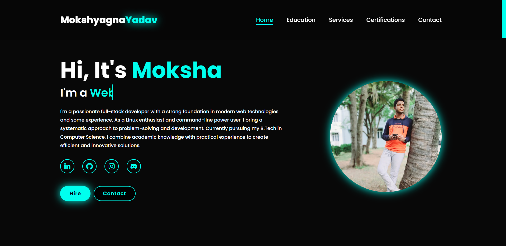

# 🌐 Moksha's Developer Portfolio

Welcome to my personal developer portfolio! This project showcases my work, skills, and certifications as a **Full-Stack Web Developer** and **Linux Enthusiast**.

---

## ✨ Features

- 🎨 **Clean & Modern UI** – Responsive design with custom styles
- 🧭 **Interactive Navigation** – Highlights active section on scroll
- 📜 **Dynamic Sections**:
  - **Home** – Introduction and links to socials
  - **Education** – Timeline-style academic history
  - **Services** – My areas of expertise
  - **Certifications** – Verified programming credentials
  - **Contact** – Responsive form layout

---

## 🛠 Tech Stack

- **Frontend:**  
    
    
    

- **Design:**  
  Poppins font, Boxicons, CSS animations

- **Tools:**  
  VS Code, Git, GitHub

---

## 🎓 Education

- **2021** – High School (Sree Akshara School, Hyderabad)  
- **2023** – MPC at Little Flower Junior College (LFJC), Hyderabad  
- **Present** – B.Tech in Computer Science Engineering at MIC College of Technology, Andhra Pradesh

---

## 📜 Certifications

| Certificate        | Issuer            | Description                           |
|--------------------|-------------------|---------------------------------------|
|  | Infosys Springboard | C Language Programming               |
|  | Google              | Android Development Certification     |
|  | Infosys Springboard | Python Programming                   |

---

## 💼 Services

- **UI Design** – Clean, accessible user interfaces  
- **Computer Networking** – Designing and managing IT networks  
- **Testing** – Quality assurance for web systems  
- **Systems** – Linux and terminal power user  

---

## 🙋 About Me

Hi, I'm **Mokshyagna Yadav** – a curious developer currently. I enjoy solving problems through code and have hands-on experience in:

- 🔧 Python, C, Java, HTML
- 🐧 Linux system operations
- 💡 Building efficient, elegant solutions

---

## 📬 Contact Me

- **LinkedIn:** [mokshyagnayadav](https://www.linkedin.com/in/mokshyagnayadav/)
- **GitHub:** [Sensui-moksha](https://github.com/Sensui-moksha)
- **Instagram:** [@mokshyagnayadav](https://www.instagram.com/mokshyagnayadav/)
- **Discord:** `Sensui#1001`

---

## 📸 Preview

> “Code is like humor. When you have to explain it, it’s bad.” – Cory House

---
